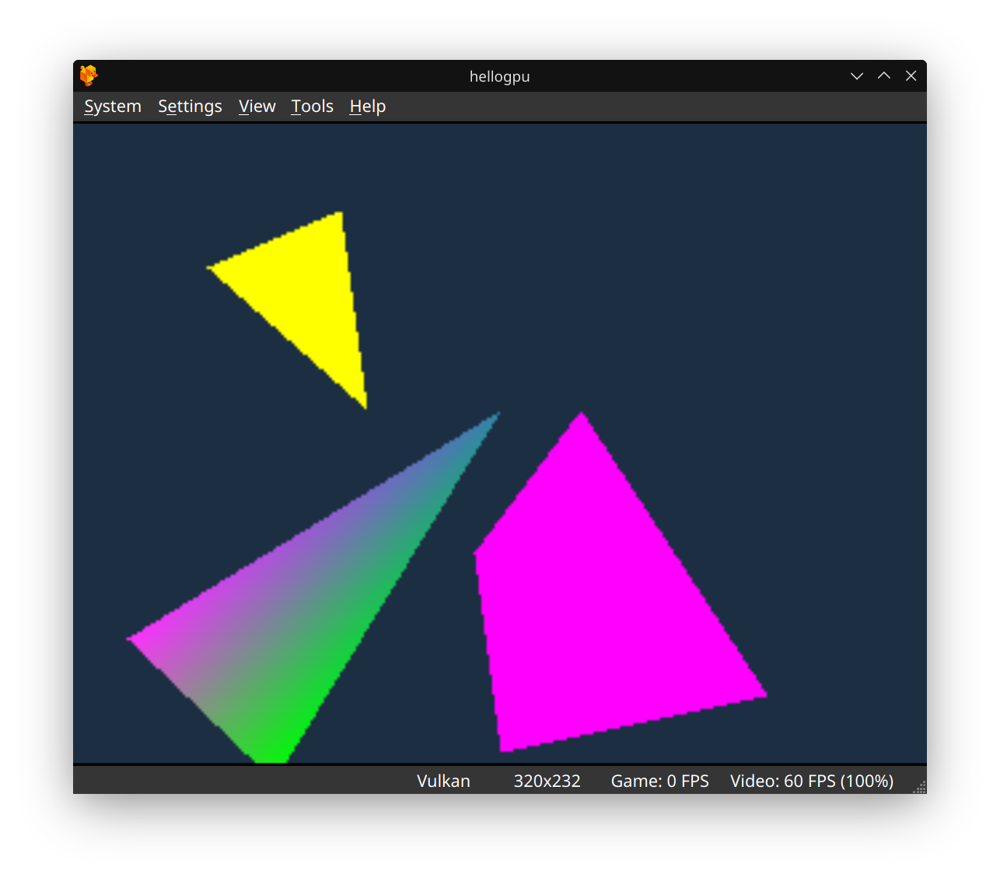

# Hello GPU Gouraud Triangle (PS1 MIPS Assembly)

This project is a step-by-step recreation of Pikuma's PS1 GPU Gouraud-shaded triangle demo, tailored for Linux users. It includes all the files and instructions needed to build and run the demo on modern systems.

---

## What is this?
A minimal PlayStation 1 homebrew example that draws:
- A yellow flat-shaded triangle (top left)
- A magenta (pink) flat-shaded quad (bottom right)
- A Gouraud-shaded triangle (bottom left) with smoothly interpolated colors (red, green, blue at each vertex)

This demonstrates both flat and Gouraud shading on the PS1 GPU using MIPS assembly.

---

## How to Build (Linux)

1. **Install prerequisites:**
   - Build or download `armips` and place it at `/home/mungdaal321/armips/build/armips` (or update the Makefile with your path).
   - Ensure you have Python 3 installed.

2. **Build the project:**
   ```bash
   make clean
   make
   ```
   This will generate `hellogpu.ps-exe`.

3. **Run in an emulator:**
   - Open `hellogpu.ps-exe` in a PS1 emulator (e.g., DuckStation).
   - You should see the following result:

   

---

## Files
- `hellogpu.s` — MIPS assembly source
- `Makefile` — Build instructions
- `bin2exe.py` — Converts binary to PS-EXE format
- `images/Screenshot_20250913_142449.png` — Demo output screenshot

---

## Why?
Setting up PS1 homebrew on Linux can be tricky. This repo aims to make it easy for anyone to follow along with Pikuma's tutorials and learn PS1 programming without the hassle.

---

*Happy hacking!*
