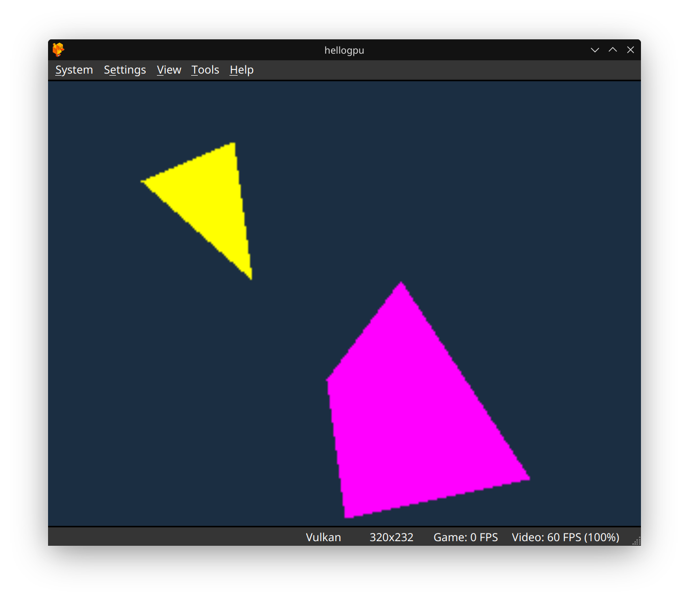

# Hello GPU Quad (PS1 MIPS Assembly)

This project is a step-by-step recreation of Pikuma's PS1 GPU quad demo, tailored for Linux users. It includes all the files and instructions needed to build and run the demo on modern systems.

---

## What is this?
A minimal PlayStation 1 homebrew example that draws both a yellow triangle and a magenta quadrilateral (quad) using MIPS assembly and the PS1 GPU. Perfect for learning low-level console programming and how to render multiple shapes!

---

## How to Build (Linux)

1. **Install prerequisites:**
   - Build or download `armips` and place it at `/home/mungdaal321/armips/build/armips` (or update the Makefile with your path).
   - Ensure you have Python 3 installed.

2. **Build the project:**
   ```bash
   make clean
   make
   ```
   This will generate `hellogpu.ps-exe`.

3. **Run in an emulator:**
   - Open `hellogpu.ps-exe` in a PS1 emulator (e.g., DuckStation).
   - You should see the following result:

   

---

## Files
- `hellogpu.s` — MIPS assembly source
- `Makefile` — Build instructions
- `bin2exe.py` — Converts binary to PS-EXE format
- `images/Screenshot_20250913_134259.png` — Demo output screenshot

---

## Why?
Setting up PS1 homebrew on Linux can be tricky. This repo aims to make it easy for anyone to follow along with Pikuma's tutorials and learn PS1 programming without the hassle.

---

*Happy hacking!*
